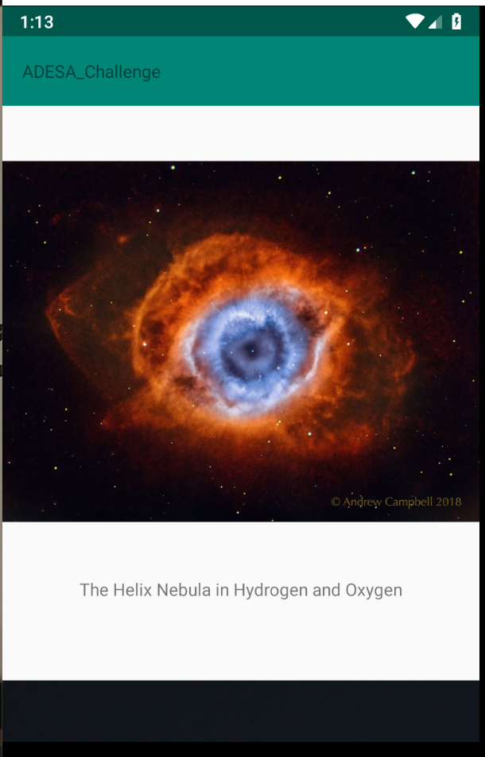
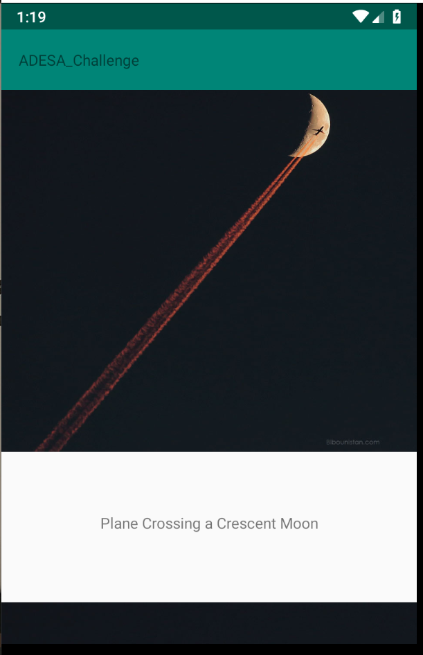
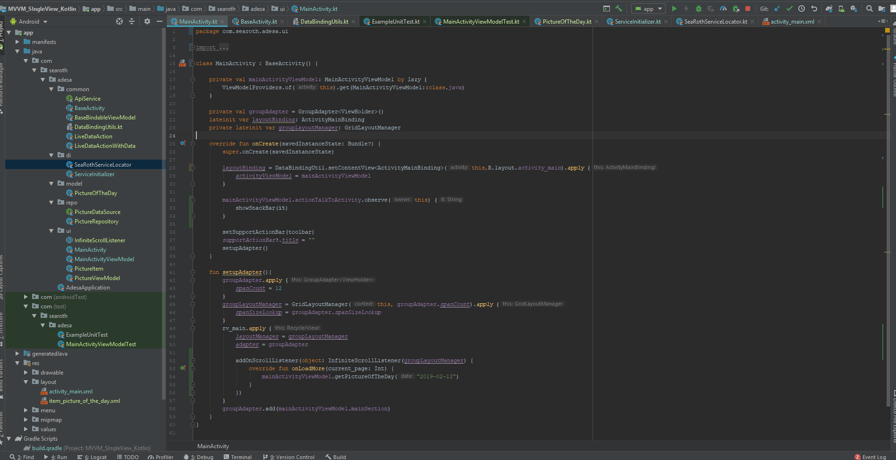

# ADESA_Challenge

How to get this project to work:
1. Open local.properties in the default directory
2. add nasa_api_key = "" to the bottom of that file
3. Put your API key inside the quotes

Given 70 minutes, complete the following:
1. Parse the NASA API Picture of the day
2. Display the image and title in a recycler view
3. Have the recycler view be infinitely scrolling
4. Display the description when the user clicks the image
5. Write some unit tests

I completed everything with two caveats:
1. I only wrote 1 unit test
2. The infinitely-scrolling list loads the second picture of the day over and over because I ran out of time to do the logic

This app uses:
1. Dependency Injection
- [INIT](https://github.com/SeaRoth/Adesa_Coding_Challenge/blob/a5dbe2d9ca9babe9ff78ea7b05c5ba1e744ca7f6/app/src/main/java/com/searoth/adesa/di/SeaRothServiceLocator.kt#L3)
- [Sample Usage](https://github.com/SeaRoth/Adesa_Coding_Challenge/blob/a5dbe2d9ca9babe9ff78ea7b05c5ba1e744ca7f6/app/src/main/java/com/searoth/adesa/ui/MainActivityViewModel.kt#L22)
2. Databinding
 - [MainActivity](https://github.com/SeaRoth/Adesa_Coding_Challenge/blob/a5dbe2d9ca9babe9ff78ea7b05c5ba1e744ca7f6/app/src/main/java/com/searoth/adesa/ui/MainActivity.kt#L28)
3. Repositories
- [Picture Repository](https://github.com/SeaRoth/Adesa_Coding_Challenge/blob/a5dbe2d9ca9babe9ff78ea7b05c5ba1e744ca7f6/app/src/main/java/com/searoth/adesa/repo/PictureRepository.kt#L8)
- [Data Source](https://github.com/SeaRoth/Adesa_Coding_Challenge/blob/a5dbe2d9ca9babe9ff78ea7b05c5ba1e744ca7f6/app/src/main/java/com/searoth/adesa/repo/PictureDataSource.kt#L6)
- [INIT SINGLETON](https://github.com/SeaRoth/Adesa_Coding_Challenge/blob/a5dbe2d9ca9babe9ff78ea7b05c5ba1e744ca7f6/app/src/main/java/com/searoth/adesa/di/ServiceInitializer.kt#L39)
- [ACCESS SINGLETON](https://github.com/SeaRoth/Adesa_Coding_Challenge/blob/a5dbe2d9ca9babe9ff78ea7b05c5ba1e744ca7f6/app/src/main/java/com/searoth/adesa/ui/MainActivityViewModel.kt#L22)
- [USE](https://github.com/SeaRoth/Adesa_Coding_Challenge/blob/a5dbe2d9ca9babe9ff78ea7b05c5ba1e744ca7f6/app/src/main/java/com/searoth/adesa/ui/MainActivityViewModel.kt#L53)
4. Retrofit
 - [Singleton](https://github.com/SeaRoth/Adesa_Coding_Challenge/blob/a5dbe2d9ca9babe9ff78ea7b05c5ba1e744ca7f6/app/src/main/java/com/searoth/adesa/di/ServiceInitializer.kt#L27)
5. Picasso
- [Singleton](https://github.com/SeaRoth/Adesa_Coding_Challenge/blob/a5dbe2d9ca9babe9ff78ea7b05c5ba1e744ca7f6/app/src/main/java/com/searoth/adesa/di/ServiceInitializer.kt#L31)
- [Data Binding Util]()
6. RXJAVA
- [USAGE](https://github.com/SeaRoth/Adesa_Coding_Challenge/blob/a5dbe2d9ca9babe9ff78ea7b05c5ba1e744ca7f6/app/src/main/java/com/searoth/adesa/ui/MainActivityViewModel.kt#L43)
7. Observable Fields to display UI
- [USAGE](https://github.com/SeaRoth/Adesa_Coding_Challenge/blob/a5dbe2d9ca9babe9ff78ea7b05c5ba1e744ca7f6/app/src/main/java/com/searoth/adesa/ui/PictureViewModel.kt#L15)
8. Live Data Actions
- [USAGE](https://github.com/SeaRoth/Adesa_Coding_Challenge/blob/a5dbe2d9ca9babe9ff78ea7b05c5ba1e744ca7f6/app/src/main/java/com/searoth/adesa/ui/PictureViewModel.kt#L19)
9. Groupie Recyclerview helper
- [ITEM](https://github.com/SeaRoth/Adesa_Coding_Challenge/blob/a5dbe2d9ca9babe9ff78ea7b05c5ba1e744ca7f6/app/src/main/java/com/searoth/adesa/ui/PictureItem.kt#L8)
- [Infinite Scroll Listener](https://github.com/SeaRoth/Adesa_Coding_Challenge/blob/a5dbe2d9ca9babe9ff78ea7b05c5ba1e744ca7f6/app/src/main/java/com/searoth/adesa/ui/InfiniteScrollListener.java#L6)

